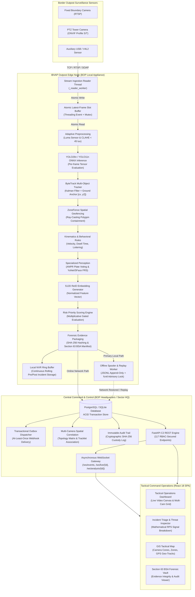

# IBVAP — Comprehensive System Architecture Document
## Intelligent Border Video Analytics Platform (SIH 2026 Problem Statement 26187)

---

## 1. Architectural Principles & System Context

IBVAP is designed as a **hybrid edge-first, decentralized border surveillance platform**.  
Traditional border surveillance architectures suffer catastrophic failures when high-bandwidth video streams are backhauled across fragile satellite or radio links to centralized servers. IBVAP solves this fundamental bottleneck by locating perception, tracking, geofencing, threat scoring, and local evidence packaging directly at the **Outpost Edge Node**, while routing low-bandwidth structured incident metadata, Merkle audit chains, and alerts to the **Central Command & Control (C2) Station**.



---

## 2. End-to-End Execution Pipeline (Stages 1 through 16)

Every video frame traversing the IBVAP pipeline passes through a strictly deterministic 16-stage pipeline:

```text
[1. Sensor Ingest] ────► [2. Reader Thread] ────► [3. Frame Slot] ────► [4. CLAHE Norm]
        │                         │                      │                    │
        ▼                         ▼                      ▼                    ▼
[5. YOLO ONNX]    ────► [6. ByteTrack]     ────► [7. ZoneFence]  ────► [8. Kinematics]
        │                         │                      │                    │
        ▼                         ▼                      ▼                    ▼
[9. ReID/FRS/ANPR]───► [10. RPS Score]    ────► [11. Evidence]   ────► [12. NVR Seal]
        │                         │                      │                    │
        ▼                         ▼                      ▼                    ▼
[13. Spool Check] ───► [14. DB Transaction]───► [15. WebSocket]  ────► [16. React Canvas]
```

### Detailed Pipeline Stages:
1. **Sensor Ingest:** Video captured by legacy analog cameras via IP encoders or modern IP cameras via standard H.264/H.265 RTSP streams.
2. **Reader Thread (`_reader_worker`):** Ingests raw RTP/AVPackets via OpenCV/FFmpeg in an independent high-priority thread, decoupling socket timeouts from inference.
3. **Latest-Frame Slot:** Stores exactly one latest frame in memory using `threading.Event` synchronization. Intermediate frames are dropped when processor falls behind, guaranteeing unbounded queue avoidance.
4. **Adaptive CLAHE Normalization:** Evaluates ambient luminance. If under 45 lux, Contrast Limited Adaptive Histogram Equalization is applied; otherwise, bypassed.
5. **YOLO Deep Neural Detection:** Executes YOLO26n / YOLO11n ONNX inference on $640\times 640$ tensor inputs to detect person, vehicle, and item bounding boxes.
6. **ByteTrack Multi-Object Tracking:** Assigns consistent trajectory IDs across frames using Kalman filter velocity predictions and Hungarian association.
7. **ZoneFence Spatial Gating:** Calculates ray-casting intersection using the ground-footprint anchor $[c_x, y_2]$ of each tracked object against geospatial polygon fences (`PUBLIC`, `BUFFER`, `RESTRICTED`).
8. **Kinematic & Behavioral Rules:** Calculates instantaneous velocity, acceleration, directional vector, loitering dwell time, and group aggregation.
9. **Specialized Biometrics, ANPR & ReID:**
   - Evaluates multi-frame plate character consensus.
   - Extracts 128D facial embeddings via YuNet/SFace.
   - Computes 512D normalized appearance embedding vectors for person re-identification.
10. **Risk Priority Scoring (RPS):** Applies multiplicative spatial gating formula $G_{\text{spatial}} \times (B_{\text{base}} + \Delta_{\text{motion}} + \Delta_{\text{env}}) \times T_{\text{persistence}} \times \Omega_{\text{operator}}$ to compute final threat score ($0.0 - 100.0$).
11. **Forensic Evidence Staging:** When threat threshold is breached, captures high-resolution crop, full frame, and metadata packet; computes SHA-256 digest.
12. **NVR Ring Buffer Sealing:** Retrieves 5 seconds of pre-alarm and 5 seconds of post-alarm rolling video clips from memory ring buffer; encodes to MP4 container.
13. **Offline Spooling Check:** If network backhaul to PostgreSQL is down, serializes event to local JSONL spool with OS advisory lock (`fcntl.flock`).
14. **Database Transaction & Outbox:** Writes incident, evidence links, and audit log atomically in PostgreSQL database; stages C2 webhook in `outbox_events`.
15. **WebSocket Broadcast:** Pushes real-time JSON alert payload and JPEG canvas frame to `/ws/events` and `/ws/live/{camera_id}` channels.
16. **React Dashboard Render:** Command operator receives sub-second audio-visual alert, bounding box overlay on WebGL canvas, and mathematical threat explanation.

---

## 3. Strict Boundary: Edge vs. Central / Control Plane

To maintain high availability and prevent architectural contamination, responsibilities between Edge Nodes and Central Stations are strictly isolated:

| Functional Domain | Edge Node Responsibility | Central / Control Station Responsibility | Architectural Invariant |
| :--- | :--- | :--- | :--- |
| **Stream Ingestion** | Connects to physical RTSP/ONVIF sockets; manages reconnections; latest-frame slot. | Does NOT ingest raw camera RTSP streams directly across wide-area network. | Zero WAN raw stream saturation. |
| **Perception & AI** | Executes YOLO object detection, ByteTrack, CLAHE, and ground anchor logic. | Aggregates high-level detection summaries; does NOT run primary object detection. | Edge handles heavy compute. |
| **Spatial Geofencing** | Evaluates polygon ray-casting locally at 30+ FPS. | Synchronizes polygon coordinates down to edge nodes upon operator edit. | Local real-time alarming. |
| **Biometrics & OCR** | Extracts embeddings and OCR bounding boxes locally. | Maintains global watchlist database and central plate registry. | Sensitive media stays local until alert. |
| **Threat Scoring** | Computes instantaneous RPS score and signal breakdown. | Allows global operator sensitivity tuning and sector-wide escalation. | Human operator override. |
| **Evidence & Storage** | Writes raw frames and video clips to local NVMe/SSD; manages rolling NVR buffer. | Stores permanent incident metadata, Merkle chains, and Section 63 certificates. | Bandwidth-conserving pull model. |
| **Network Outage Mode** | Spools all events to append-only JSONL; continues uninterrupted local surveillance. | Detects edge node heartbeat loss; marks outpost as DEGRADED / OFFLINE. | Outpost operates 100% autonomously. |
| **Recovery & Sync** | Replays spooled JSONL records upon link restoration using advisory locks. | Ingests replayed events idempotently without creating duplicate alerts. | Zero event loss across network cuts. |
| **Operator C2 Interface** | Provides local emergency fallback UI if isolated. | Hosts full multi-camera GIS dashboard, global search, and central audit log. | Unified command visibility. |

---

## 4. Software Subsystems & Component Architecture

### 4.1. Edge Perception Engine (`edge/`)
* **`edge/adapters/`:** Implements `BaseCameraAdapter`, `RTSPCameraAdapter`, `ONVIFCameraAdapter`, `LocalCameraAdapter`, `FileCameraAdapter`, and `SyntheticCameraAdapter`.
* **`edge/tracking/bytetrack.py`:** Pure Python/NumPy ByteTrack tracker implementing dual-threshold Kalman filter matching and tracklet state management.
* **`edge/zones/fence.py`:** Geospatial polygon containment engine utilizing the Jordan curve theorem (even-odd rule ray-casting) with anchor $[c_x, y_2]$.
* **`edge/scoring/engine.py`:** Multiplicative spatial-gated threat calculator producing canonical RPS scores and explainability arrays.
* **`edge/correlation/cross_camera.py`:** Spatial-temporal cross-camera tracker matching 512D ReID vectors across overlapping field-of-view topologies.

### 4.2. Central Backend & API Engine (`backend/app/`)
* **`backend/app/services/live_pipeline.py`:** Coordinates multi-threaded ingestion workers, latest-frame slots, and pipeline dispatches.
* **`backend/app/services/camera_health_worker.py`:** Independent async daemon monitoring socket health and frame intervals.
* **`backend/app/services/outbox_dispatcher.py`:** Reliable transactional outbox worker dispatching webhook alerts with exponential backoff.
* **`backend/app/services/spool_replay.py`:** Background replay worker ingesting spooled JSONL records upon link recovery.
* **`backend/app/services/evidence.py`:** Generates cryptographic SHA-256 Merkle proofs and legal metadata.
* **`backend/app/core/security.py`:** Enforces JWT creation, verification, password hashing, and fail-closed secret validation.
* **`backend/app/api/deps.py`:** Enforces 5-tier role-based access control (`require_permission`) across all endpoints.

### 4.3. Tactical Frontend Dashboard (`frontend/src/`)
* **`frontend/src/views/LiveMonitorView.tsx`:** Real-time multi-camera tactical monitor with custom WebSocket video canvas rendering.
* **`frontend/src/views/IncidentTriageView.tsx`:** Interactive incident triage table with mathematical threat explanation modal and QRT dispatch.
* **`frontend/src/views/ThermalDroneView.tsx`:** Simulated sensor view with explicit disclosure badge: `[SIMULATED TELEMETRY & POST-PROCESS COLORMAP]`.
* **`frontend/src/components/LegalCertificateModal.tsx`:** Section 63 BSA legal certificate viewer displaying SHA-256 hash chains.

---

## 5. Architectural Reliability & Fail-Closed Invariants

1. **Unbounded Backlog Prevention:** The atomic latest-frame slot guarantees that slow downstream inference never causes memory exhaustion or network socket starvation.
2. **Production Fail-Closed Startup:** The backend refuses to start in `production` or `staging` if `JWT_SECRET` is missing, shorter than 32 characters, or matches repository development defaults.
3. **Database Independence at Edge:** Outpost edge nodes require zero active database connections to capture, track, and score threats; all events persist locally until connectivity is verified.
4. **Idempotent Incident Ingestion:** Every incident generated at the edge carries a deterministic UUID based on camera ID, track ID, and timestamp, preventing duplicate entries during network flap replay.
